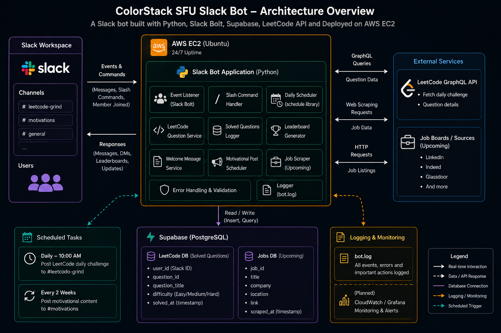

# ColorStack SFU Slack Bot

A Slack bot built with Python, Slack Bolt, Supabase, and the LeetCode GraphQL API — automating LeetCode accountability, motivational content, and Canadian tech internship job posting for the ColorStack SFU chapter at Simon Fraser University. Deployed 24/7 on AWS EC2.

---

## Architecture



---

## Features

- **New Member Welcome** — Sends a personalized DM to any user who joins a monitored channel.
- **Daily LeetCode Challenge** — Fetches and posts the LeetCode daily question to `#leetcode-grind` every day at 10:00 AM UTC via the LeetCode GraphQL API.
- **Solve Logging** — `/leetcode [problem] [difficulty]` logs a completed solve to Supabase and posts a confirmation to `#leetcode-grind`.
- **Leaderboard** — `/leetcode leaderboard` queries Supabase and posts a ranked leaderboard to `#leetcode-grind`.
- **Invalid Command Handling** — Sends a helpful DM when an empty or unrecognized `/leetcode` command is used.
- **Motivational Image Posts** — Posts a random image from `assets/motivational_images/` to `#motivations` every Monday and Thursday at 09:00 AM UTC.
- **Canadian Internship Job Scraping** — Scrapes the Canadian Tech Internships 2026 GitHub repo, deduplicates via Supabase, and posts new listings to `#general` four times daily.
- **Error Handling & Logging** — All events, errors, and scheduled actions are logged to `bot.log`.

---

## Tech Stack

| Layer | Technology |
|---|---|
| Language | Python 3.12 |
| Slack Integration | Slack Bolt (Socket Mode) |
| Database | Supabase (PostgreSQL) |
| Hosting | AWS EC2 t3.micro — Ubuntu 24.04 |
| Process Management | systemd |
| Scheduling | `schedule` + `threading` |
| HTTP | `requests` |
| Config | `python-dotenv` |

---

## Setup

1. Clone the repository:
   ```bash
   git clone https://github.com/Olisaemeka-Paul-Ani/colorstack-sfu-slack-bot.git
   cd colorstack-sfu-slack-bot
   ```

2. Create and activate a virtual environment:
   ```bash
   python -m venv venv
   source venv/bin/activate  # Windows: venv\Scripts\activate
   ```

3. Install dependencies:
   ```bash
   pip install -r requirements.txt
   ```

4. Create a `.env` file in the project root:
   ```
   SLACK_BOT_TOKEN=xoxb-...
   SLACK_APP_TOKEN=xapp-...
   SUPABASE_URL=https://your-project.supabase.co
   SUPABASE_KEY=your-service-role-key
   LEETCODE_CHANNEL_ID=C...
   MOTIVATIONS_CHANNEL_ID=C...
   GENERAL_CHANNEL_ID=C...
   ```

5. Run the bot:
   ```bash
   python main.py
   ```

---

## Deployment (AWS EC2)

The bot runs as a systemd service for 24/7 uptime.

```bash
# Check service status
sudo systemctl status colorstack-bot.service

# Restart after a code update
sudo systemctl restart colorstack-bot.service

# Tail live logs
journalctl -u colorstack-bot.service -f
```

---

## Author

**Olisaemeka Paul Ani**
[LinkedIn](https://www.linkedin.com/in/olisaemeka-paul-ani/) | [GitHub](https://github.com/Olisaemeka-Paul-Ani)